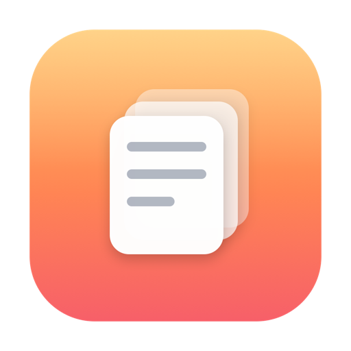

<p align="center">
  
</p>

# Pastil

A clipboard history manager for macOS. Hit a hotkey and a glass shelf slides up from the
bottom of the screen with everything you've copied recently — text, links, code, colors,
files, images. Pick one and it pastes straight back into the app you were in.

It's a small native app written in Swift and SwiftUI, built after spending too long wanting
the [Paste](https://pasteapp.io) app's shelf without the subscription: minimal cards, the
source app's icon on each clip, and the Liquid Glass look on macOS 26.

## What it does

- Keeps a searchable history of what you copy. Everything stays on your Mac — nothing is
  uploaded anywhere.
- Summons a bottom shelf with `⌘⇧V`. Type to search, arrow keys to move, `Return` to paste.
- Pastes back into whatever app had focus, so it works the way the system clipboard does —
  just with history.
- Sorts clips into categories. Drag a card onto a category, or right-click it. Categories
  have custom names and colors.
- Knows the difference between text, links, code, hex colors, files and images, and previews
  each one sensibly.
- Stays out of the way: no Dock icon, no menu bar icon. It runs in the background and only
  shows up when you ask for it.

## Requirements

- macOS 14 or later. macOS 26 ("Tahoe") gets the full Liquid Glass appearance; older versions
  fall back to a frosted material.
- Apple Silicon or Intel.
- To build from source: the Swift toolchain (install Xcode, or run `xcode-select --install`).

## Build and run

```sh
git clone https://github.com/<you>/pastil.git
cd pastil
bash script/build_and_run.sh
```

That compiles the app, assembles `dist/Pastil.app`, and launches it. Press `⌘⇧V` to open the
shelf. Quit from the shelf's `⋯` menu.

If you'd rather not build it, grab a `.app` from the [Releases](../../releases) page (a
universal build for any Mac, plus an Apple-Silicon-only build). Because those aren't notarized
by Apple, the first launch is blocked by Gatekeeper — right-click the app and choose **Open**,
or run `xattr -dr com.apple.quarantine /path/to/Pastil.app` once.

## Keyboard shortcuts

| Shortcut | Action |
| --- | --- |
| `⌘⇧V` | Show / hide the shelf |
| `←` / `→` | Move between clips |
| `Return` | Paste the selected clip |
| `⇧Return` | Paste as plain text |
| `⌘C` | Copy the selected clip again |
| `⌘1`–`⌘9` | Switch category |
| `Delete` | Remove the selected clip (when the search box is empty) |
| `Esc` | Close the shelf |

You can also drag a clip out of the shelf and drop it into any app.

## Auto-paste and Accessibility

Pressing `Return` pastes into the app you came from by sending a synthetic `⌘V`. macOS only
allows that for apps you've trusted, so the first time you'll need to allow Pastil under
**System Settings → Privacy & Security → Accessibility** (the shelf's `⋯` menu has a shortcut
to that pane). Until then, the clip is still on the clipboard — you can paste it by hand.

A dev build is signed ad-hoc, which means its identity changes every time you rebuild, and the
Accessibility grant resets with it. To make the grant stick across rebuilds, run
`bash script/setup_signing.sh` once. It creates a stable local signing certificate; rebuild
afterward and grant the permission a final time.

## Settings

Open Settings from the shelf's `⋯` menu:

- how many clips to keep,
- whether to capture images,
- launch at login,
- apps to ignore (password managers are skipped by default so secrets never land in history).

## How it works

The shelf is a non-activating `NSPanel` pinned to the bottom edge of the screen. Non-activating
matters: it can take keyboard input without stealing focus from the app underneath, so the
paste lands where you expect. A lightweight timer watches the system pasteboard and records
changes. History lives in `~/Library/Application Support/Pastil/library.json`.

The project is plain SwiftPM with no third-party dependencies. Source is under `Sources/Pastil`,
and the helper scripts (`build_and_run.sh`, `setup_signing.sh`, `package.sh`, `make_icon.swift`)
are under `script/`.
